# СУДОКУ

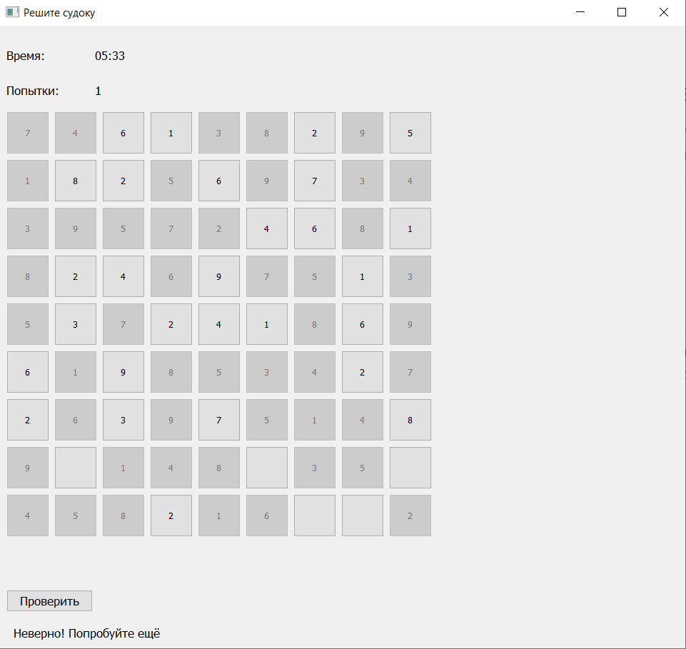

## Автор проекта

Колесов Александр

## Описание

Этот проект был создан с помощью библиотеки PyQt.
Это многооконное приложение, имитирующее знакомую для многих игру "Судоку".

## Принцип работы

Сначала программа проверяет был ли произведён вход в аккаунт.
В случае отрицательного ответа открывается стартовое окно.

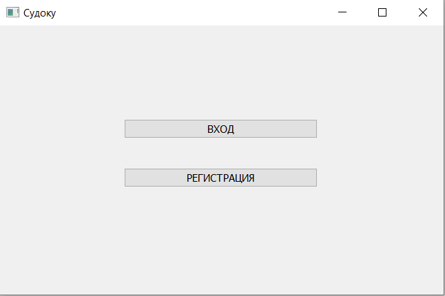

Здесь вы можете зарегистрировать новый аккаунт или войти в уже существующий.

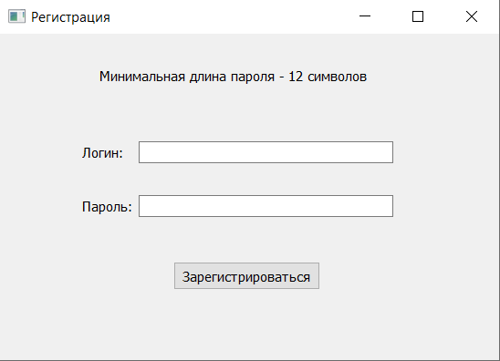

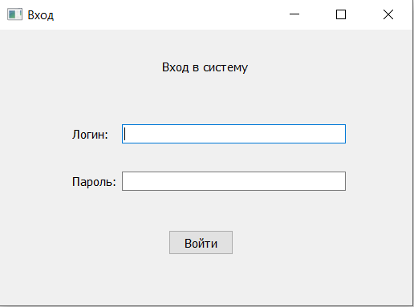

При регистрации вы должны учитывать ряд правил:

- Ни логин, ни пароль не могут быть пустыми;

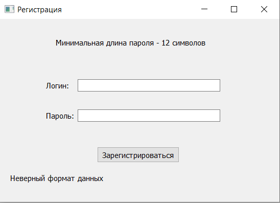

- Минимальная длина пароля - 12 символов;

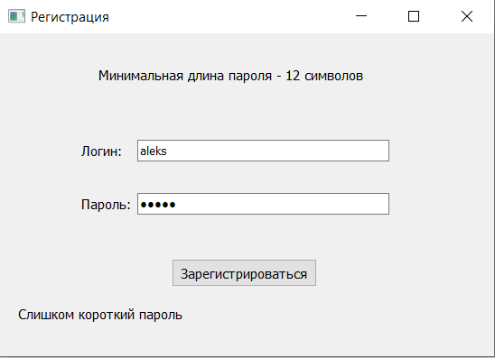

- В пароле должны присутсвовать буквы верхнего и нижнего регистров, цифры и специальные символы.

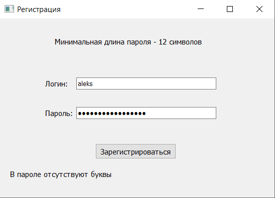

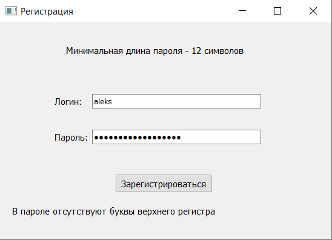

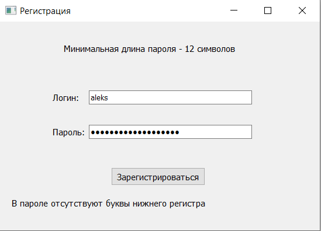

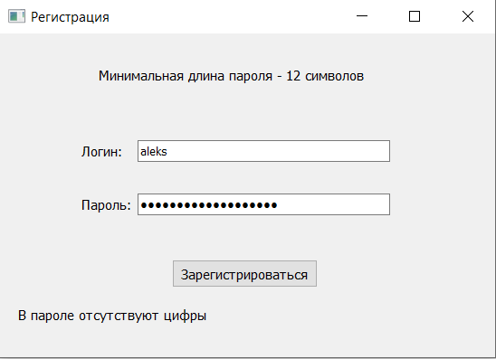

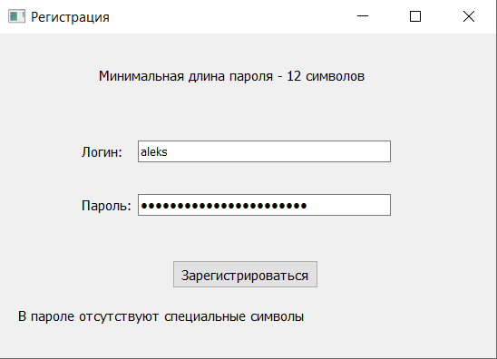

При входе также учитывайте следующие нюансы:

- Как и при регистрации, ни логин, ни пароль не должны быть пустыми;

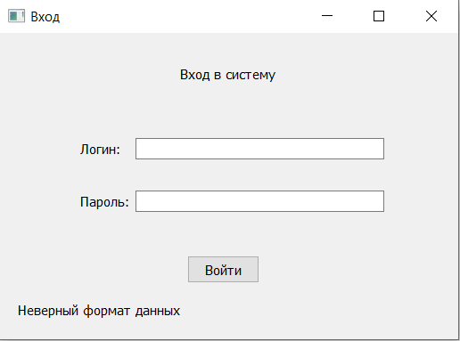

- Аккаунт с этими данными уже существует.

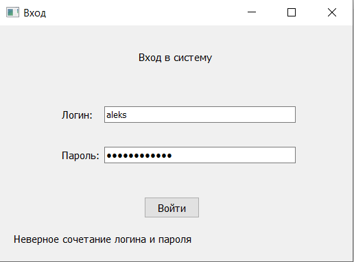

После входа в аккаунт или после его создания (или если вход был осуществлён заранее) мы получаем доступ к основному экрану.

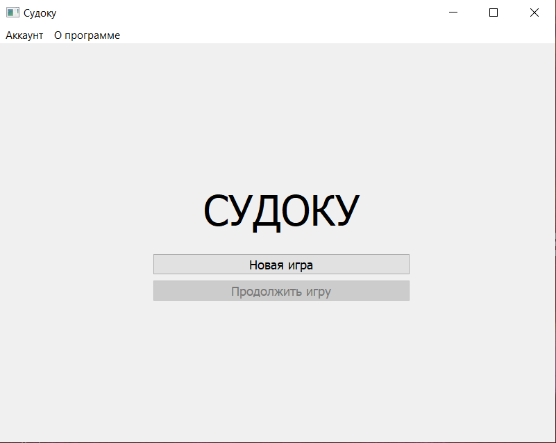

Меню "Аккаунт" содержит опции для работы с аккаунтом.

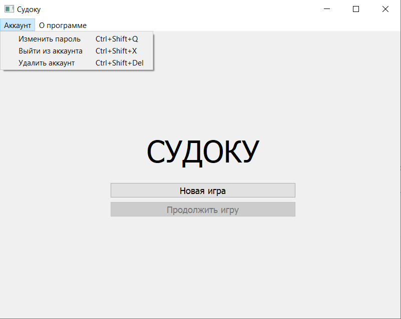

При выборе опции "Изменить пароль" (или использовании комбинации Ctrl+Shift+Q) откроется окно для ввода нового пароля.

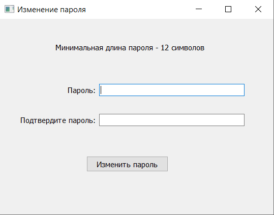

После нажатия на кнопку "OK" программа проверяет пароль по тем же правилам, что и при регистрации.
Но учитывайте, что новый пароль должен отличаться от предыдущего.
Если новый пароль соответствует требованиям, ваш старый пароль изменится на этот.

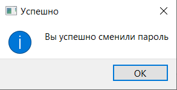

В случае ошибки можно попробовать ввести пароль ещё раз.

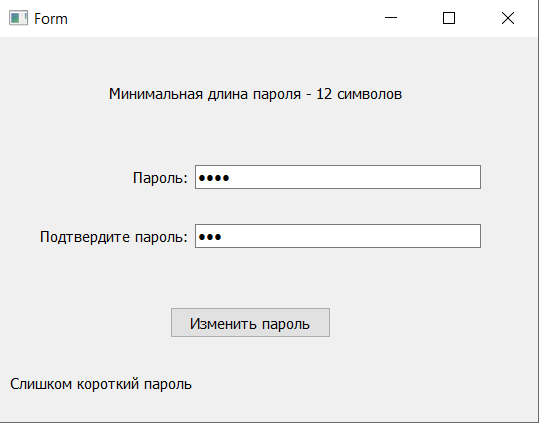

При выборе опции "Выйти из аккаунта" (или использовании комбинации Ctrl+Shift+X) программа спросит у вас, действительно ли вы хотите выйти.

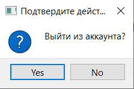

В случае утвердительного ответа программа вернёт вас на стартовое окно.

При выборе опции "Удалить аккаунт" (или использовании комбинации Ctrl+Shift+Del) происходит то же самое, однако ваш аккаунт удаляется из базы данных.

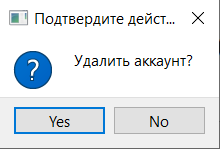

При нажатии на кнопку "Новая игра" открывается окно с выбором уровня сложности.

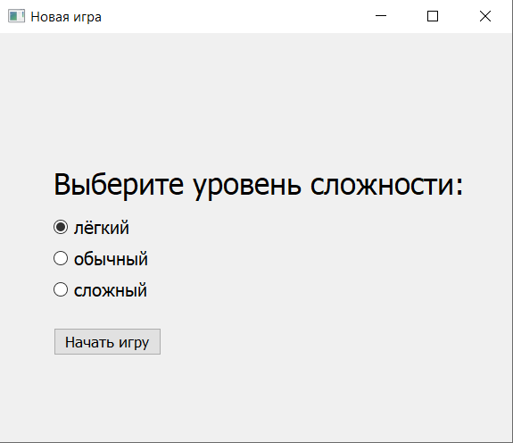

После нажатия на кнопку "Начать игру" программа выбирает случайное судоку из имеющихся для выбранного уровня сложности.
После чего открывается окно с самой игрой.

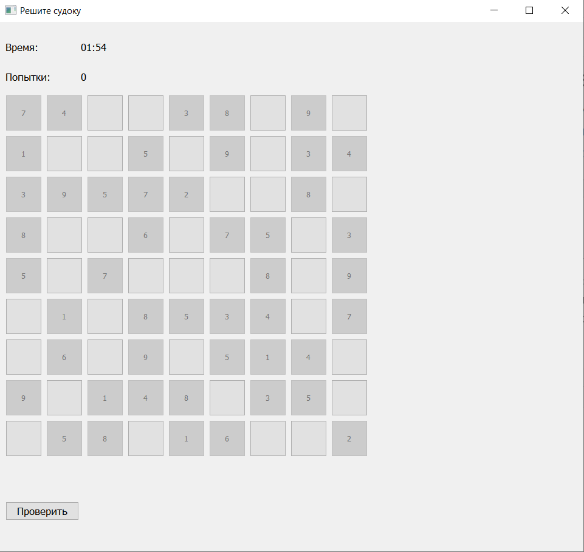

Чтобы записать число в одну из ячеек, нажмите на неё.
После этого откроется окно с вводом числа.

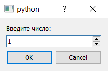

После нажатия на кнопку "OK" число запишется в ячейку.
Ячейки с исходными данными не подлежат редактированию.

После нажатия на кнопку "Проверить" программа проверяет, решено ли судоку.

В случае отрицательного ответа она проверяет все ячейки, которые вы заполнили.
Если ячейка заполнена правильно, она также становится недоступной для редактирования.

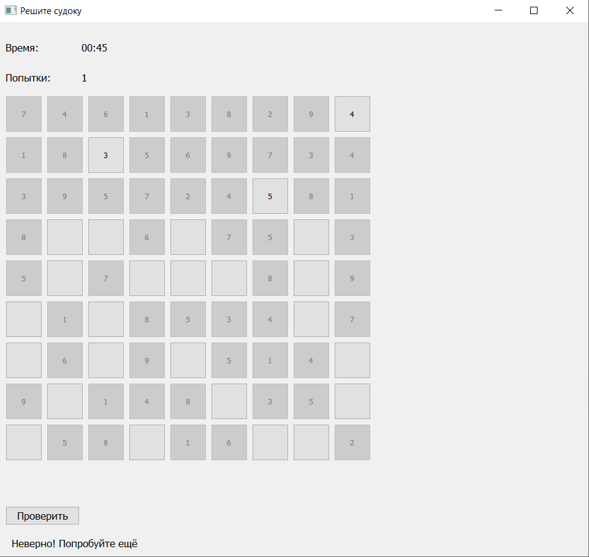

В случае утвердительного ответа программа открывает поздравительное окно.

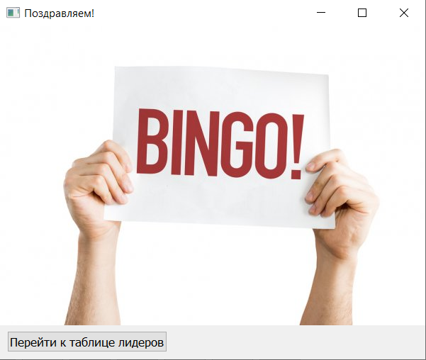

Если вы закроете это окно программа вернёт вас на основной экран.

В случае нажатия на кнопку, откроется таблица лидеров по этому судоку.

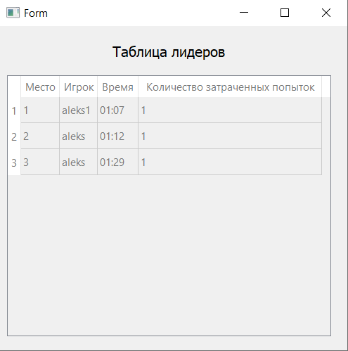

После того, как вы закроете это окно, программа вернёт вас на основной экран.

Если вы попытаетесь закрыть окно с игрой, программа спросит вас, хотите ли вы сохранить результат.

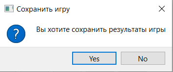

Если вы не выбрали "Cancel", программа вернёт вас на основной экрани, в случае утвердительного ответа, кнопка "Продолжить игру" станет доступной.

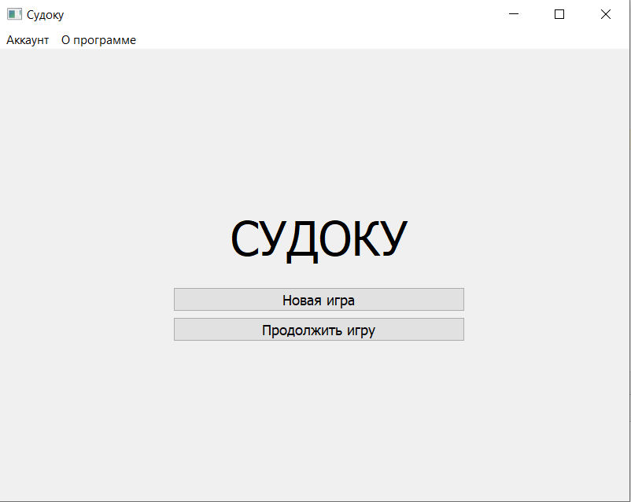

Если вы выбрали "Cancel" или закрыли диалоговое окно, вы сможете продолжить играть.

## Описание технологий

Чтобы программа работала корректно, необходимо установить библиотеку PyQt5 (минимально допустимая версия 5.15.6).

## Структура проекта

Проект содержит следующие файлы:

1. Main_window.py - основной файл проекта (основное окно);
2. Start_window.py - стартовое окно;
3. Logging_in.py - окно для входа;
4. Registration.py - окно для регистрации;
5. Change_password.py - окно для изменения пароля;
6. New_game.py - окно с выбором сложности;
7. Sudoku.py - окно для решения судоку;
8. Winner.py - поздравительное окно;
9. Leaders.py - окно с таблицей лидеров;
10. Файлы типа '*_ui.ui' - дизайны окон;
11. Файлы типа '*_ui.py' - py-файлы, сгенерированные на основе дизайнов;
12. sudoku.sqlite - база данных проекта;
13. readme.md - файл, который вы сейчас читаете;
14. presentation.pptx - презентация с описанием проекта;
15. help.docx - вспомогательный файл для пользователей;
16. requirements.txt - список библиотек, необходимых для корректной работы проекта. Для установки запустите: pip install -r requirements.txt;
17. easy - папка, содержащая в себе 20 лёгких судоку, записанных в csv-файлах;
18. normal - папка, содержащая в себе 20 обычных судоку, записанных в csv-файлах;
19. hard - папка, содержащая в себе 20 тяжёлых судоку, записанных в csv-файлах;
20. images - папка, содержащая в себе все картинки, используемые в проекте;
21. saved_games - папка, содержащая в себе сохранённые промежуточные результаты, записанные в csv-файлах;
22. exe - папка, содержащая файл Main_window.exe, позволяющий открыть программу без интерпретатора Python.